# 🏥 MediCore – Hospital Management Dashboard

<p align="center">
  
</p>

<p align="center">
A modern, responsive, feature-rich Hospital Management Dashboard built using <strong>HTML, CSS, and JavaScript</strong>.
</p>

<p align="center">


</p>

---

## 🌐 Live Demo

🔗 **Live Website:** https://probal2005.github.io/MediCore/

---

# 📖 Overview

MediCore is a complete Hospital Management Dashboard designed to manage every department of a hospital from one centralized interface.

The project includes:

- Patient Management
- Doctor Management
- Appointment Scheduling
- Billing & Finance
- Pharmacy
- Laboratory
- Radiology
- ICU
- Emergency
- Blood Bank
- HR & Payroll
- Reports & Analytics
- Authentication System
- Dark / Light Theme
- Responsive Dashboard

---

# ✨ Features

## 👨‍⚕️ Authentication

- Login System
- Role Based Dashboard
- Session Management
- Secure Validation

---

## 📊 Dashboard

- Hospital Statistics
- Revenue Overview
- Daily Appointments
- Patient Analytics
- Bed Occupancy
- Department Summary
- Charts & Graphs

---

## 👨‍⚕️ Doctors

- Add Doctor
- Edit Doctor
- Delete Doctor
- Department Assignment
- Availability
- Search
- Filter

---

## 🧑 Patients

- Patient Registration
- Medical History
- Patient Profile
- Admit / Discharge
- Search Patient

---

## 📅 Appointments

- Book Appointment
- Reschedule
- Cancel
- Calendar View
- Doctor Availability

---

## 💊 Pharmacy

- Medicine Inventory
- Stock Management
- Prescription
- Medicine Sales

---

## 🧪 Laboratory

- Test Orders
- Reports
- Test Status
- Result Management

---

## 🩻 Radiology

- X-Ray
- MRI
- CT Scan
- Imaging Reports

---

## 🩸 Blood Bank

- Blood Inventory
- Donor Records
- Blood Requests
- Blood Groups

---

## 🛏 Ward Management

- Bed Allocation
- Patient Admission
- Ward Availability

---

## 🚑 Emergency

- Emergency Cases
- Ambulance Status
- Critical Patients

---

## ❤️ ICU

- ICU Bed Monitoring
- Critical Patient Records
- Live Status

---

## 🏥 Operation Theater

- Surgery Schedule
- OT Availability
- Operation Records

---

## 👩‍⚕️ Nurse Station

- Nurse Assignment
- Shift Management
- Patient Monitoring

---

## 👥 Staff Management

- Staff Directory
- Roles
- Department Management

---

## 💰 HR & Payroll

- Employee Salary
- Payroll Reports
- Leave Records
- Salary Slips

---

## 🕒 Attendance

- Attendance Tracking
- Shift Attendance
- Reports

---

## 🛡 Insurance

- Insurance Providers
- Claims
- Patient Coverage

---

## 💳 Billing

- Invoice Generation
- Payment Tracking
- Receipts

---

## 💹 Finance

- Revenue
- Expenses
- Financial Reports

---

## 📈 Analytics

- Interactive Charts
- Hospital Insights
- Revenue Analytics
- Patient Trends

---

## ⚙ Settings

- User Profile
- Theme
- Notifications
- System Settings

---

## 📄 Reports

- Export PDF
- Export CSV
- Monthly Reports
- Financial Reports

---

# 🌟 Technology Stack

| Technology | Usage |
|------------|------|
| HTML5 | Structure |
| CSS3 | Styling |
| JavaScript (ES6) | Logic |
| Chart.js | Charts |
| Flatpickr | Calendar |
| Font Awesome | Icons |
| Google Fonts | Typography |

---

# 📂 Project Structure

```
MediCore
│
├── index.html
│
├── css
│   ├── reset.css
│   ├── variables.css
│   ├── components.css
│   ├── dashboard.css
│   ├── auth.css
│   ├── animations.css
│   └── responsive.css
│
├── js
│   ├── data
│   ├── utils
│   ├── components
│   ├── modules
│   ├── router.js
│   ├── store.js
│   └── main.js
│
└── assets
```

---

# 🔑 Demo Credentials

## 👑 Administrator

```
Email:
admin@medicore.com

Password:
Admin123!
```

---

## 👨‍⚕️ Doctor

```
Email:
doctor@medicore.com

Password:
Doctor123!
```

---

## 👩‍💼 Reception

```
Email:
reception@medicore.com

Password:
Reception12
```

---

# 🖼 Preview

## 🔐 Login Page

```
docs/previews/login.png
```

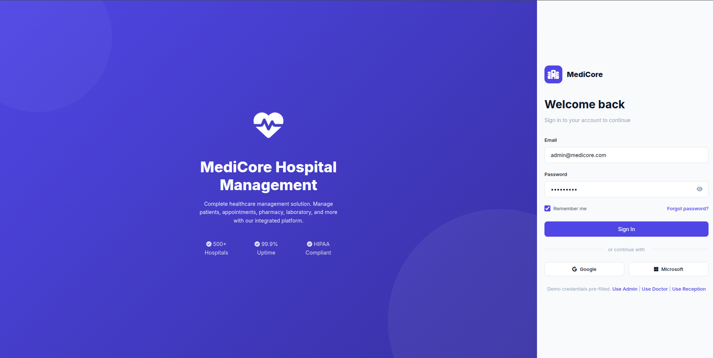

---

## 📊 Dashboard

```
docs/previews/dashboard.png
```

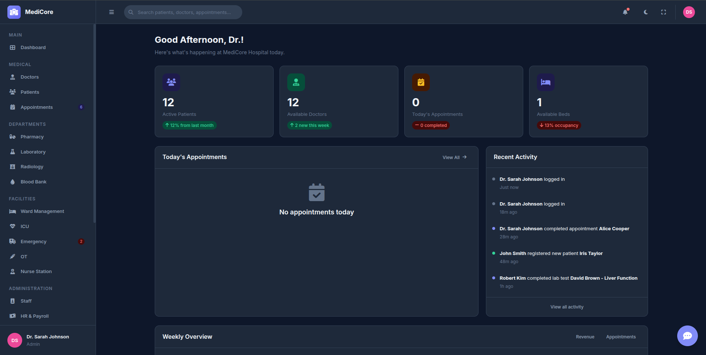

---

## 👨‍⚕️ Doctors

```
docs/previews/doctors.png
```

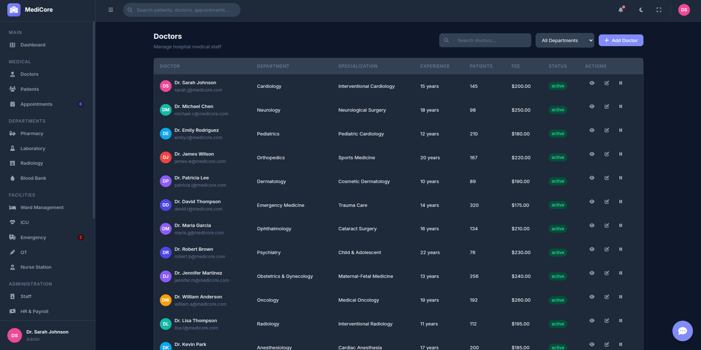

---

## 🧑 Patients

```
docs/previews/patients.png
```

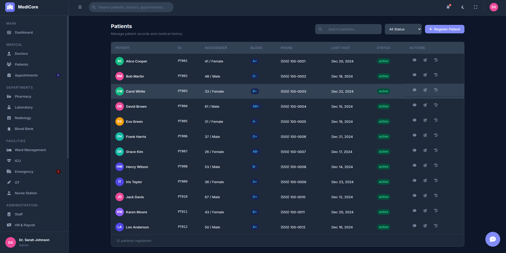

---

## 📅 Appointments

```
docs/previews/appointments.png
```

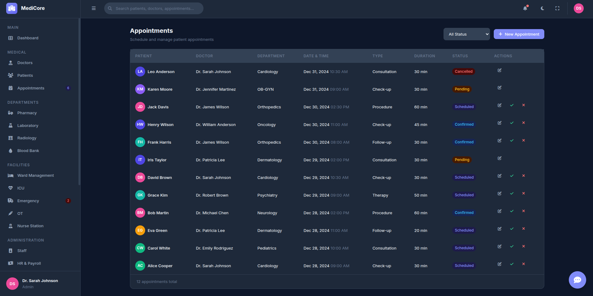

---

## 💊 Pharmacy

```
docs/previews/pharmacy.png
```

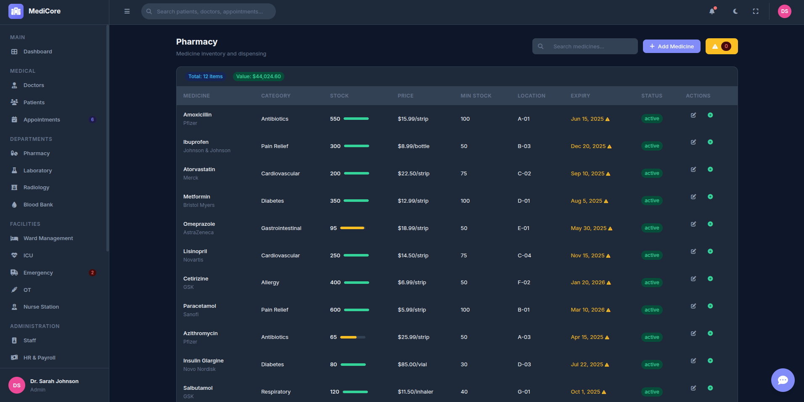

---

## 🧪 Laboratory

```
docs/previews/laboratory.png
```

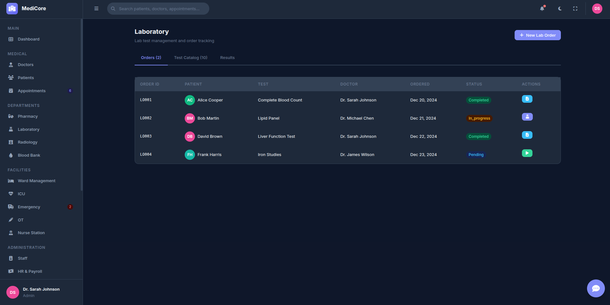

---

## 🩻 Radiology

```
docs/previews/radiology.png
```


---

## 🩸 Blood Bank

```
docs/previews/bloodbank.png
```

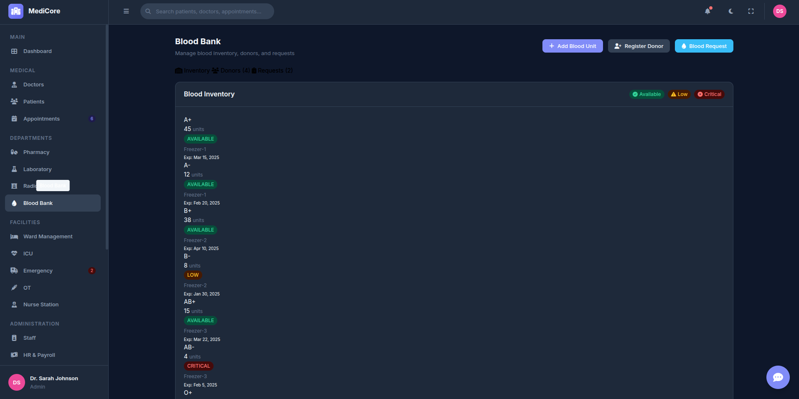

---

## 🛏 Ward

```
docs/previews/ward.png
```

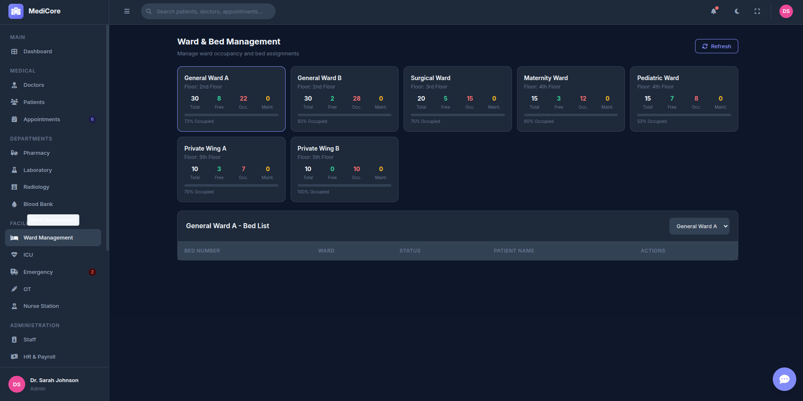

---

## ❤️ ICU

```
docs/previews/icu.png
```

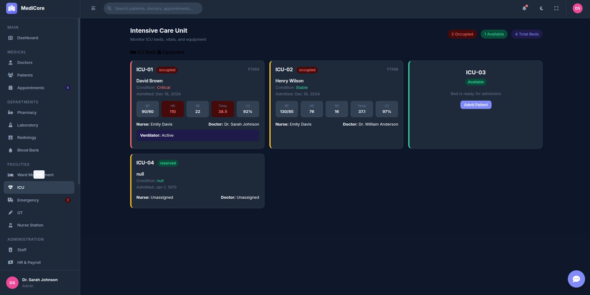

---

## 🚑 Emergency

```
docs/previews/emergency.png
```

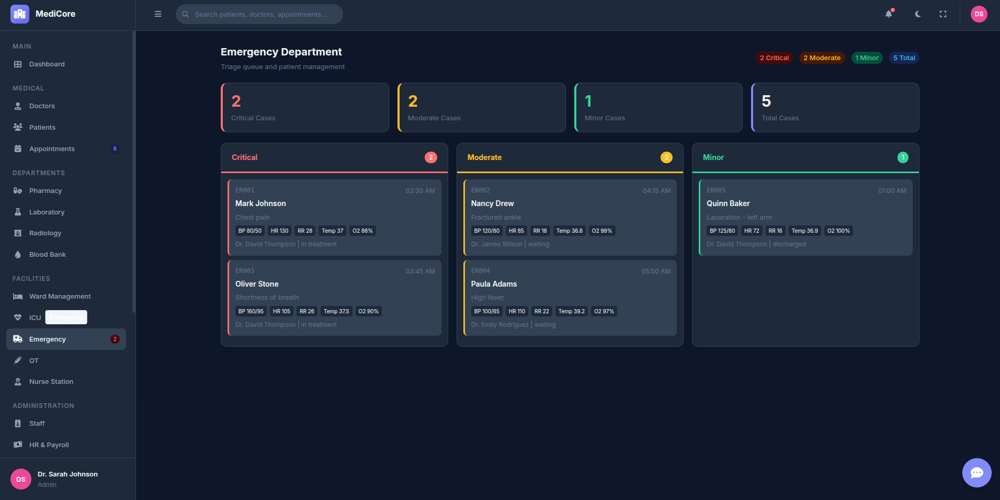

---

## 🏥 Operation Theater

```
docs/previews/operation-theater.png
```

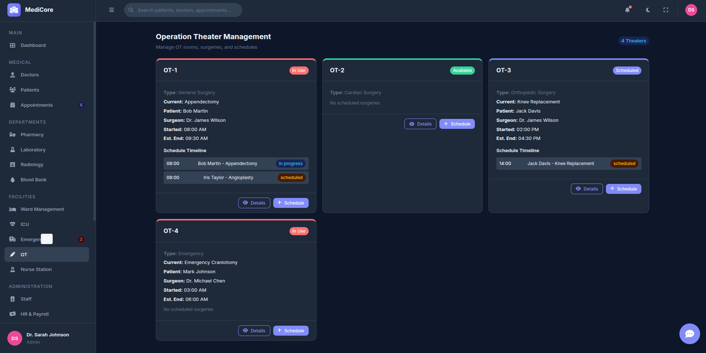

---

## 👩‍⚕️ Nurse Station

```
docs/previews/nurse-station.png
```

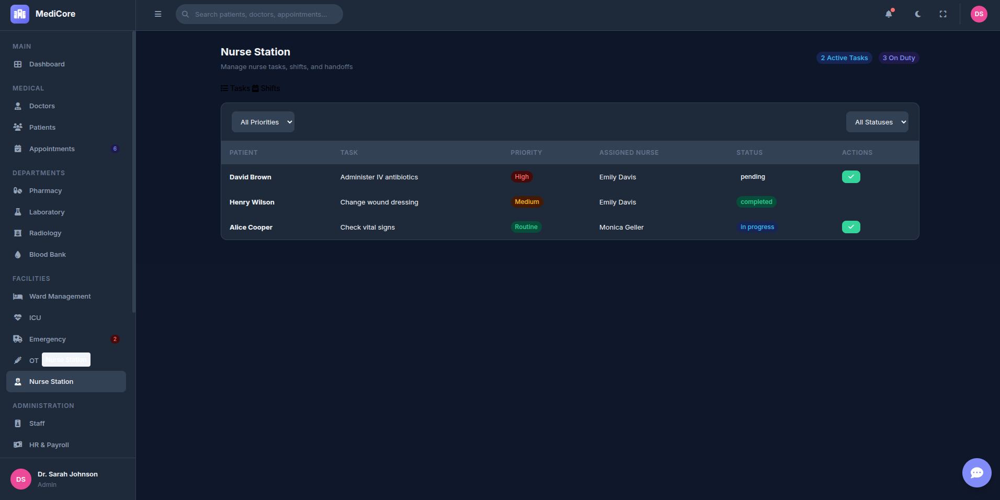

---

## 👥 Staff

```
docs/previews/staff.png
```

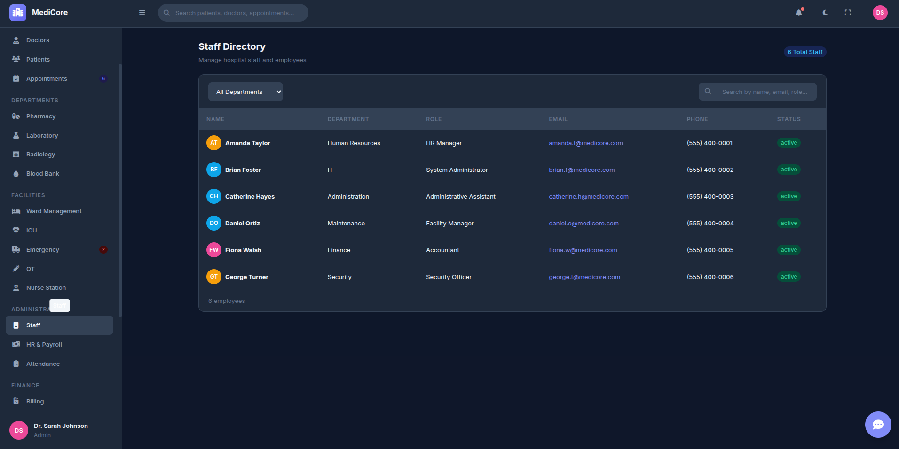

---

## 💰 HR & Payroll

```
docs/previews/hr-payroll.png
```

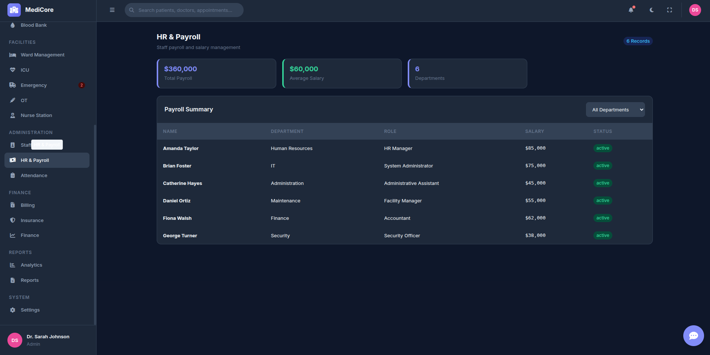

---

## 🕒 Attendance

```
docs/previews/attendance.png
```

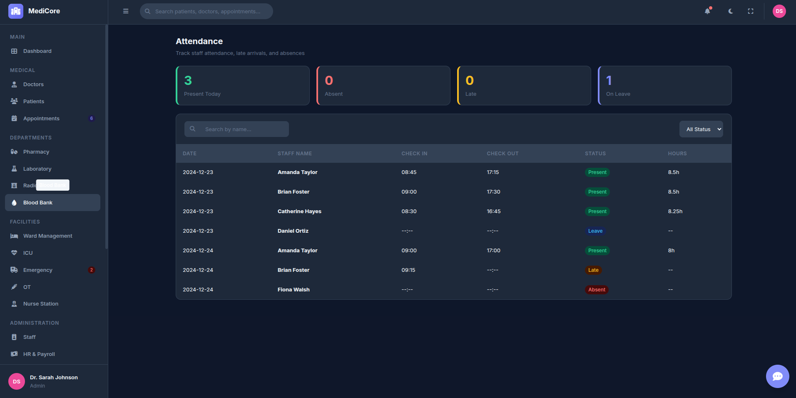

---

## 🛡 Insurance

```
docs/previews/insurance.png
```

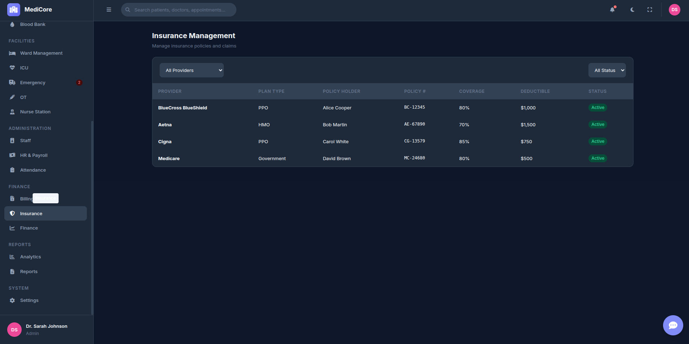

---

## 💳 Billing

```
docs/previews/billing.png
```

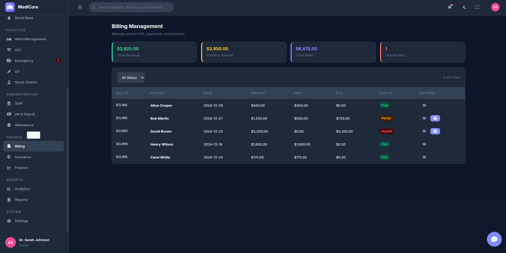

---

## 💹 Finance

```
docs/previews/finance.png
```

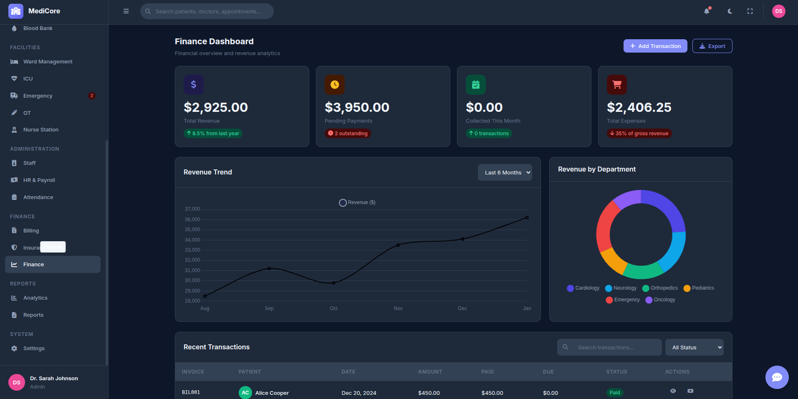

---

## 📈 Analytics

```
docs/previews/analytics.png
```


---

## ⚙ Settings

```
docs/previews/settings.png
```

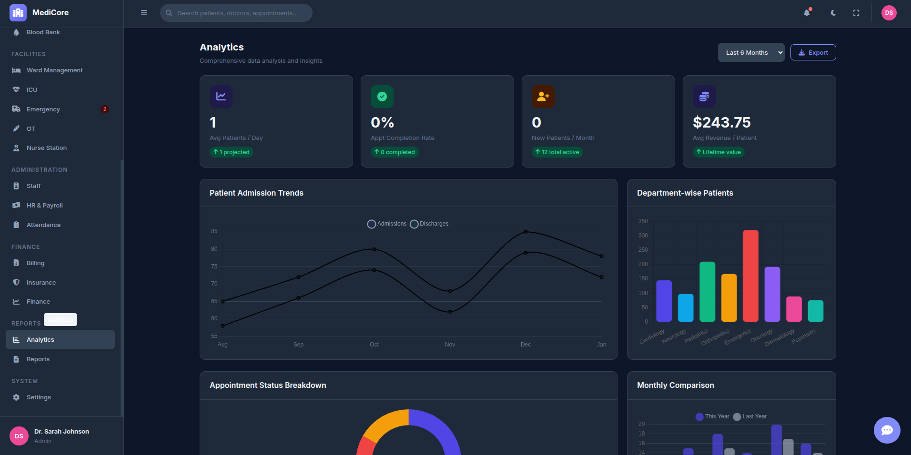

---

## 📄 Reports

```
docs/previews/reports.png
```

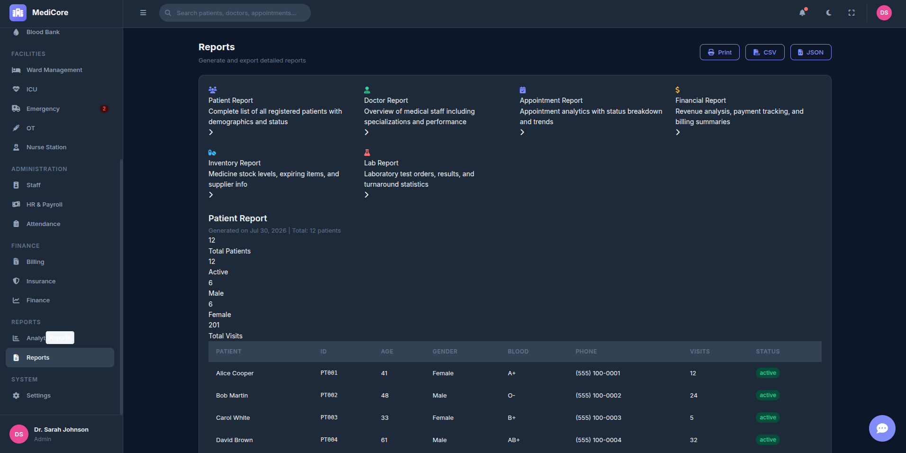

---

# 🚀 Installation

```bash
git clone https://github.com/yourusername/medicore.git

cd medicore
```

Open:

```
index.html
```

or run using **Live Server**.

---

# 📱 Responsive Design

✅ Desktop

✅ Laptop

✅ Tablet

✅ Mobile

---

# 🌙 Theme Support

- Light Mode
- Dark Mode
- Theme Persistence

---

# 📤 Export Support

- CSV Export
- PDF Export
- Printable Reports

---

# 📜 License

This project is licensed under the MIT License.

---

# 👨‍💻 Author

**Probal Dhali**

GitHub: https://github.com/probal2005

---

## ⭐ If you like this project, don't forget to give it a Star!
